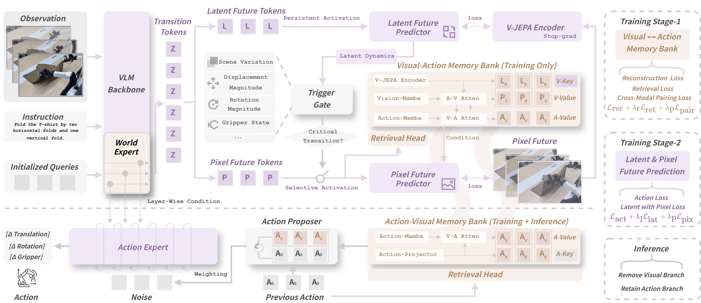
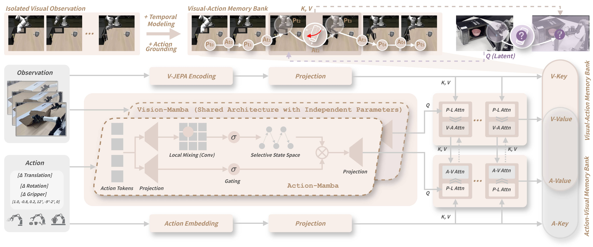
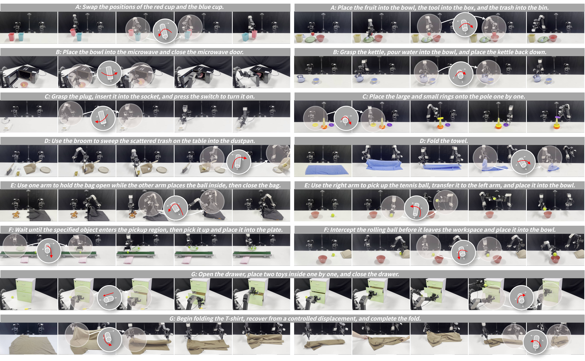

<div align="center">

<h2 class="papername">
UniMPA: A Unified Memory-Prediction-Action Model<br>
via Action-Grounded Transition Modeling
</h2>

<div>
    <a href="https://liwei-2013.github.io/" target="_blank">Wei Li</a><sup>1</sup>,
    <a href="https://rshaojimmy.github.io/OrionLab/" target="_blank">Rui Shao*</a><sup>1</sup>,
    Jie He<sup>1</sup>,
    Lingsen Zhang<sup>1</sup>,
    <a href="https://liuziwei7.github.io/" target="_blank">Ziwei Liu</a><sup>2</sup>,
    <a href="https://liqiangnie.github.io/" target="_blank">Liqiang Nie</a><sup>1</sup>
</div>

<br>

<sup>1</sup>School of Computer Science and Technology, Harbin Institute of Technology, Shenzhen<br>
<sup>2</sup>S-Lab, Nanyang Technological University, Singapore<br>

*Corresponding author<br>

<a href="https://arxiv.org/abs/XXXX.XXXXX">
    
</a>

<h3 align="center">
    <strong>
    🛠️ We're still cooking — Stay tuned! 🛠️<br>
    ⭐ Give us a star if you like it! ⭐<br>
    ✨ If you find this work useful for your research, please kindly cite our paper. ✨
    </strong>
</h3>

</div>

## :fire: Introduction

**UniMPA** is a **Unified Memory-Prediction-Action model** for robotic manipulation.
Recent Vision-Language-Action (VLA) models learn to map observations directly to
actions, but this observation-to-action shortcut is limited by a fundamental
**transition realizability gap**, which manifests as three tightly coupled problems:

- **Transition ambiguity.** Visually similar current observations may correspond to
  different manipulation phases and therefore imply different subsequent transitions.
- **Prediction–execution mismatch.** A visually plausible predicted future observation
  does not necessarily correspond to a physically realizable transition.
- **Experience–realization mismatch.** A historically executable action pattern does not
  necessarily realize the intended transition in the current scene, and therefore
  requires context-aware adaptation.

The key insight of **UniMPA** is that future prediction, memory, and action generation
should not be treated as independent capabilities. Instead, they can be organized around
a shared **action-grounded transition** interface, so that an intended world change is
first anticipated, then grounded in executable experience, and finally refined into an
action for the current scene. UniMPA realizes this through three coupled designs:

- **Persistent-Selective Future Prediction** resolves transition ambiguity by modeling the
  intended future state evolution. A persistent latent stream continuously tracks
  task-level progress, while a trigger-gated pixel stream selectively resolves
  fine-grained interaction changes at transition-critical moments.
- **Visual-Action Memory Bank** assesses the physical executability of the anticipated
  transition. The predicted transition queries temporally aligned visual–action
  trajectories, retrieving historically realized experience as executable evidence
  rather than matching frame-level appearance.
- **Action-Visual Memory Bank + Prototype-Biased Flow** adapts executable experience to the
  current scene. Historical actions with their aligned visual evolution retrieve a
  visually grounded action prototype, and the flow source is shifted toward this
  historically supported action manifold instead of replaying the prototype as-is.

Together, these components form a unified **anticipate–ground–refine** process from
intended transition to executable action.

<div align="center">

</div>

## :gear: Method

The overall framework of **UniMPA** couples future-supervised transition modeling,
bidirectional visual–action memory, and action generation through a single
action-grounded transition interface.

<div align="center">

</div>

1. **World Expert.** Zero-initialized transition queries are transported into latent
   transition tokens conditioned on the current context. Training-only latent and
   trigger-gated pixel heads supervise these tokens with future outcomes, adding
   interaction-time detail without dense-reconstruction bias.
2. **Bidirectional retrieval.** The transition representation queries the Visual-Action
   Memory Bank for action-grounded visual experience, while historical actions query the
   Action-Visual Memory Bank to construct executable action prototypes.
3. **Action generation.** The retrieved prior biases the initial flow distribution, which
   the Action Expert then refines for the current observation, instruction, and robot state.
4. **Inference.** Only the explicit latent and pixel decoding heads are removed. The World
   Expert and its transition tokens remain active and, together with the retrieved
   action-manifold prior, condition action generation.

Stateful Vision-Mamba and Action-Mamba modules encode episode-level temporal
correspondence, while cross-stream transition grounding injects action-conditioned
dynamics into visual memories and visual-transition semantics into action memories.

<div align="center">

</div>

Training follows a two-stage recipe. In **Stage 1**, the bidirectional memory bank is
pretrained with future-oriented reconstruction, retrieval-simulation, and cross-modal
alignment objectives, so that keys index transitions and values preserve temporally
evolved vision–action dynamics. In **Stage 2**, the memory banks are frozen, and
persistent latent prediction, trigger-gated pixel prediction, and flow-matching action
generation are jointly optimized on top of the $\pi_{0.5}$ backbone.

## :bar_chart: Results

**UniMPA** is evaluated on four simulation benchmarks and two real-world bimanual
platforms, covering general manipulation, zero-shot robustness, out-of-distribution
generalization, semantic understanding, and long-horizon real-world manipulation.

- **LIBERO.** 98.6% average success rate, surpassing the strongest reported baseline on a
  near-saturated benchmark, while using only 25% of the training epochs of $\pi_0$ / $\pi_{0.5}$.
- **LIBERO-Plus.** 85.3% average success under seven perturbation dimensions, ranking first
  among general, prediction-based, and memory-based methods (+11.7 points over $\pi_{0.5}$),
  with the smallest performance drop from the original setting.
- **RoboTwin 2.0.** 58.2% average success on the Randomized (Hard) setting while training
  only on Clean demonstrations (+18.5 over $\pi_{0.5}$, +25.7 over HALO), ranking first on 8/11 tasks.
- **VLABench.** 44.0% average success (+4.3 over $\pi_{0.5}$), best or tied-best on four of six tasks.
- **Real world (GALAXEA R1 Lite).** 21 tasks in seven manipulation suites, 77.7% TSR / 86.3% CSR
  versus 65.3%/75.6% for $\pi_{0.5}$ and 45.7%/58.1% for OpenVLA-OFT.
- **Real world (AgileX Cobot Magic).** 74.9% TSR / 86.4% CSR on seven representative tasks
  (+12.6/+11.5 over $\pi_{0.5}$), with the largest gains on long-horizon composition and
  recovery (+20.0/+14.9).

Gains are most pronounced on transition-critical settings: long-horizon composition,
dynamic and reactive interaction, and recovery after failure, where the robot must keep
execution phase-consistent and adapt executable experience to a changing scene.

<div align="center">

</div>

## :movie_camera: Videos

Real-world rollouts on the seven manipulation suites will be released here.

<!-- To add a clip: drag the .mp4 into a GitHub issue/comment, then replace the
     corresponding placeholder line with:
     <video src="https://github.com/user-attachments/assets/XXXXXXXX" controls muted width="100%"></video> -->

<table>
  <tr>
    <td align="center" width="33%">
      <i>coming soon</i>
      <br>
      <b>Semantic Rearrangement &amp; Sorting</b>
    </td>
    <td align="center" width="33%">
      <i>coming soon</i>
      <br>
      <b>Articulated &amp; Container Interaction</b>
    </td>
    <td align="center" width="33%">
      <i>coming soon</i>
      <br>
      <b>Precision Assembly &amp; Geometric Manipulation</b>
    </td>
  </tr>
  <tr>
    <td align="center" width="33%">
      <i>coming soon</i>
      <br>
      <b>Deformable &amp; Tool-Mediated Manipulation</b>
    </td>
    <td align="center" width="33%">
      <i>coming soon</i>
      <br>
      <b>Bimanual Coordination</b>
    </td>
    <td align="center" width="33%">
      <i>coming soon</i>
      <br>
      <b>Dynamic &amp; Reactive Manipulation</b>
    </td>
  </tr>
  <tr>
    <td align="center" width="33%">
      <i>coming soon</i>
      <br>
      <b>Long-Horizon Composition &amp; Recovery</b>
    </td>
    <td align="center" width="33%"></td>
    <td align="center" width="33%"></td>
  </tr>
</table>

## :open_file_folder: Code Release

We are preparing the code, pretrained checkpoints, and evaluation scripts.
Please stay tuned.

- [ ] Training code
- [ ] Evaluation code
- [ ] Pretrained checkpoints
- [ ] Memory bank pretraining scripts
- [ ] Real-world rollout videos
- [ ] Simulation benchmark scripts

## :memo: Citation

If you find this work useful for your research, please kindly cite our paper:

```bibtex
@article{li2026unimpa,
  title={UniMPA: A Unified Memory-Prediction-Action Model via Action-Grounded Transition Modeling},
  author={Li, Wei and Shao, Rui and He, Jie and Zhang, Lingsen and Liu, Ziwei and Nie, Liqiang},
  journal={arXiv preprint arXiv:XXXX.XXXXX},
  year={2026}
}
```
